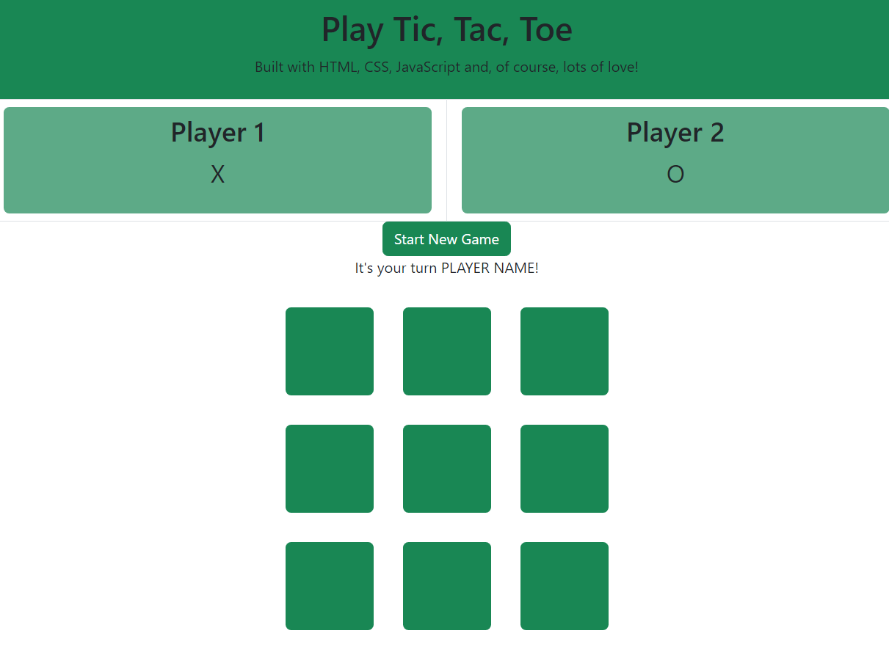

# Basic website using CSS Framework - Tic Tac Toe Game

## Table of contents

- [Overview](#overview)
  - [The challenge](#the-challenge)
  - [Screenshot](#screenshot)
  - [Links](#links)
- [My process](#my-process)
  - [Built with](#built-with)
- [Author](#author)
- [Acknowledgments](#acknowledgments)

## Overview

### The challenge

Users should be able to:

- Play the classic Tic Tac Toe Game
- View the optimal layout depending on their device's screen size

### Screenshot

### Links

- Live Site URL: [Live Site](https://nicolas1102.github.io/tic-tac-toe-with-bootstrap/)

## My process

### Built with

- Semantic HTML5 markup
- CSS custom properties
- JS
- Boostrap
- Flexbox
- Mobile-first workflow

## Author

- Website - [Nicolas Diaz](https://nicolas1102.github.io/portfolio/)
- Linkedin - [Nicolas Diaz](www.linkedin.com/in/nicolas-diaz-vargas)
- Instagram - [@nicolasdiaz_1102](https://www.instagram.com/nicolasdiaz_1102/?theme=dark)
